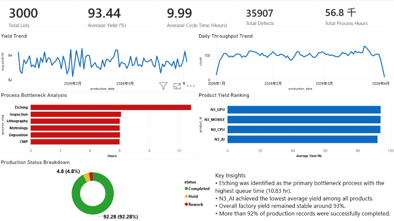

# Semiconductor Manufacturing KPI Dashboard

## Project Overview

This project simulates a semiconductor manufacturing environment and builds an end-to-end analytics pipeline using Python, SQLite, SQL, and Power BI.

The objective is to monitor factory performance, identify bottleneck processes, evaluate product yield performance, and analyze production status through a manufacturing KPI dashboard.

---

## Tools

* Python
* pandas
* SQLite
* SQL
* Power BI

---

## Project Architecture

```text
Simulated Fab Data
        ↓
Python ETL
        ↓
SQLite Database
        ↓
SQL KPI Analysis
        ↓
CSV Data Mart
        ↓
Power BI Dashboard
```

---

## Dataset

Since real semiconductor manufacturing data is typically confidential, a synthetic fab dataset was generated using Python.

### Simulated Data Characteristics

* 3,000 production lots
* 18,000 process records
* Multiple process steps:

  * Lithography
  * Etching
  * Deposition
  * CMP
  * Metrology
  * Inspection
* Multiple product types:

  * N3_CPU
  * N3_GPU
  * N3_MOBILE
  * N3_AI

### Captured Manufacturing Metrics

* Queue Time
* Process Time
* Cycle Time
* Yield Rate
* Defect Count
* Production Status
* Equipment Utilization Workload

---

## Business Questions

This project aims to answer the following manufacturing questions:

* Which process step is the primary bottleneck?
* How does factory throughput change over time?
* How stable is production yield?
* Which product has the highest and lowest yield?
* What is the overall production completion rate?
* What are the key operational KPIs of the factory?

---

## Dashboard Preview



---

## Key Performance Indicators (KPIs)

### Production

* Total Lots
* Total Process Hours
* Daily Throughput
* Average Cycle Time

### Quality

* Average Yield
* Total Defects
* Product Yield Ranking

### Manufacturing Operations

* Bottleneck Analysis
* Production Status Distribution

---

## Key Insights

### Bottleneck Analysis

* Etching was identified as the primary bottleneck process.
* Average queue time reached 10.83 hours.
* Average cycle time reached 14.76 hours.
* Queue time accounted for more than 73% of total cycle time.

### Yield Performance

* Overall factory yield remained stable around 93%.
* N3_AI achieved the lowest average yield among all products.
* Product yield differences remained relatively small across product families.

### Production Status

* More than 92% of production records were successfully completed.
* Hold and Rework records accounted for less than 8% of total production activities.

### Throughput

* Factory throughput remained relatively stable throughout the observation period.
* Daily production volume generally ranged between 90 and 120 lots.

---

## SQL Analysis

| File                       | Description                 |
| -------------------------- | --------------------------- |
| 01_daily_throughput.sql    | Daily throughput trend      |
| 02_wip_by_process.sql      | WIP distribution by process |
| 03_cycle_time_analysis.sql | Cycle time analysis         |
| 04_equipment_workload.sql  | Equipment workload analysis |
| 05_bottleneck_analysis.sql | Bottleneck identification   |
| 06_yield_trend.sql         | Yield trend analysis        |
| 07_hold_rework_rate.sql    | Production status analysis  |
| 08_product_performance.sql | Product yield ranking       |
| 09_queue_time_analysis.sql | Queue time analysis         |
| 10_factory_summary.sql     | Factory KPI summary         |

---

## Project Structure

```text
Semiconductor Manufacturing KPI Dashboard
│
├── data
│   ├── raw
│   │   └── simulated_fab_data.csv
│   │
│   └── processed
│       ├── analytics_fab.db
│       └── query_results
│
├── scripts
│   ├── generate_fab_data.py
│   ├── load_to_sqlite.py
│   ├── run_queries.py
│   └── test_sqlite.py
│
├── sql
│   ├── 01_daily_throughput.sql
│   ├── 02_wip_by_process.sql
│   ├── 03_cycle_time_analysis.sql
│   ├── 04_equipment_workload.sql
│   ├── 05_bottleneck_analysis.sql
│   ├── 06_yield_trend.sql
│   ├── 07_hold_rework_rate.sql
│   ├── 08_product_performance.sql
│   ├── 09_queue_time_analysis.sql
│   └── 10_factory_summary.sql
│
├── dashboard
│   ├── semiconductor_dashboard.pbix
│   └── dashboard_preview.png
│
└── README.md
```

---

## Future Improvements

Potential future enhancements include:

* OEE (Overall Equipment Effectiveness) Analysis
* Equipment Downtime Tracking
* Real-Time Manufacturing Monitoring
* Predictive Yield Modeling
* Predictive Maintenance Analytics
* MES-Style Production Dashboard
* Multi-Fab Performance Comparison

---
